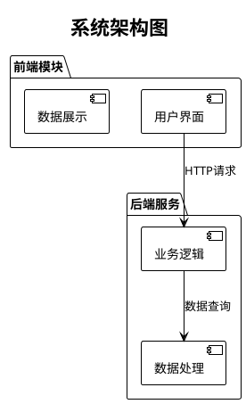

# PlantUML 中文支持 Docker 配置

支持中文显示的PlantUML服务器Docker配置，解决原版镜像中文显示异常的问题。

## 问题说明

原版PlantUML Docker镜像 `plantuml/plantuml-server:jetty` 不支持中文字体，导致：
- 中文字符显示为方块 □□□
- 图表中的中文标题、注释无法正常显示
- 影响中文项目的文档可视化

## 解决方案

通过自定义Dockerfile，在原版镜像基础上：
1. 安装中文字体包（文泉驿字体系列）
2. 配置字体映射
3. 设置Java UTF-8编码支持

## 快速开始

### 方法一：使用启动脚本（推荐）

```bash
# 进入docker目录
cd docker

# 运行启动脚本
./start-plantuml.sh
```

启动脚本会自动：
- 检查Docker环境
- 停止冲突的服务
- 构建并启动服务
- 等待服务就绪
- 显示访问信息

### 方法二：使用docker-compose

```bash
# 进入docker目录
cd docker

# 构建并启动服务
docker-compose up -d --build

# 查看服务状态
docker-compose ps

# 查看日志
docker-compose logs -f plantuml-server
```

### 方法三：直接使用Docker命令

```bash
# 进入docker/plantuml目录
cd docker/plantuml

# 构建镜像
docker build -t plantuml-chinese .

# 运行容器
docker run -d --name plantuml-server-chinese -p 8888:8080 plantuml-chinese
```

## 访问服务

- **服务地址**: http://localhost:8888
- **测试地址**: http://localhost:8888/uml/SyfFKj2rKt3CoKnELR1Io4ZDoSa70000

## 中文支持验证

### 1. 在PUML文件中添加字体配置



### 2. 支持的中文字体

镜像中安装了以下中文字体：
- **文泉驿正黑** (WenQuanYi Zen Hei) - 推荐使用
- **文泉驿微米黑** (WenQuanYi Micro Hei)
- **AR PL UKai CN** (楷体)
- **AR PL UMing CN** (明体)

## 常用命令

```bash
# 查看容器状态
docker ps | grep plantuml

# 查看容器日志
docker logs plantuml-server-chinese

# 进入容器调试
docker exec -it plantuml-server-chinese /bin/bash

# 停止服务
docker stop plantuml-server-chinese

# 重启服务
docker restart plantuml-server-chinese

# 删除容器
docker rm plantuml-server-chinese

# 删除镜像
docker rmi plantuml-chinese
```

## 项目集成

### 在项目中使用

如果你的项目需要生成PUML图表，可以配置服务器地址：

```javascript
// 示例：JavaScript中配置PlantUML服务器
const PLANTUML_SERVER = 'http://localhost:8888';

function generateDiagramUrl(pumlCode) {
  const encoded = encode64(pumlCode);
  return `${PLANTUML_SERVER}/svg/${encoded}`;
}
```

### 环境变量配置

可以通过环境变量自定义配置：

```bash
# docker-compose.yml 中的环境变量
environment:
  - JAVA_OPTS=-Dfile.encoding=UTF-8 -Dsun.jnu.encoding=UTF-8 -Djava.awt.headless=true
  - PLANTUML_LIMIT_SIZE=8192
```

## 故障排除

### 1. 端口冲突

如果8888端口被占用：

```bash
# 查看端口占用
lsof -i :8888

# 修改docker-compose.yml中的端口映射
ports:
  - "8889:8080"  # 改为其他端口
```

### 2. 中文仍然显示异常

检查PUML代码是否添加了字体配置：

```plantuml
# 必须添加这两行
!theme plain
skinparam defaultFontName "WenQuanYi Zen Hei,WenQuanYi Micro Hei,sans-serif"
```

### 3. 容器启动失败

查看详细日志：

```bash
docker logs plantuml-server-chinese
```

### 4. 字体未正确安装

进入容器检查字体：

```bash
docker exec -it plantuml-server-chinese fc-list | grep -i chinese
```

## 技术细节

### Dockerfile说明

- **基础镜像**: `plantuml/plantuml-server:jetty`
- **字体包**: 安装4个中文字体包
- **字体配置**: 创建fontconfig配置文件
- **编码设置**: 设置Java UTF-8编码参数

### 支持的图表类型

所有PlantUML支持的图表类型都可以显示中文：
- 用例图 (Use Case)
- 类图 (Class)
- 活动图 (Activity)
- 组件图 (Component)
- 部署图 (Deployment)
- 对象图 (Object)
- 包图 (Package)
- 序列图 (Sequence)
- 协作通信图 (Communication)
- 状态图 (State)
- 时序图 (Timing)

## 版本信息

- **PlantUML版本**: 基于官方最新版本
- **Java版本**: OpenJDK 11+
- **字体版本**: 文泉驿字体最新版本
- **更新日期**: 2024年