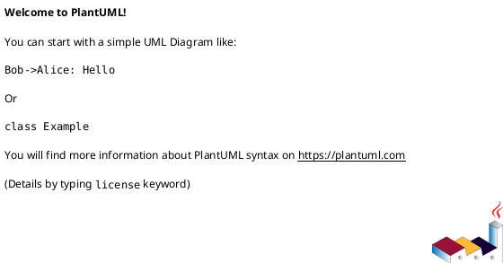

# AI辅助业务项目开发 - 必需文件清单

## 分阶段提供文档
- **第一阶段**：项目需求文档 + 系统架构图 + 业务流程图 + 数据模型图 + 交互流程图
- **第二阶段**：技术规范文档 + API设计 + 数据库设计
- **第三阶段**：开发流程文档 + 测试用例文档 + 部署文档


## 文件结构
```
project_root/
├── docs/                          # 文档目录
│   ├── requirements.md            # 需求文档
│   ├── technical_spec.md          # 技术规范
│   ├── api_design.md              # API设计
│   ├── database_design.md         # 数据库设计
│   └── deployment.md              # 部署文档
├── development/                   # 开发文档
│   └── development_process.md     # 开发流程
├── design/                        # 设计文件
│   ├── architecture.puml          # 架构图
│   ├── interaction.puml           # 交互流程图
│   ├── data_model.puml            # 数据模型图
│   └── business_flow.puml         # 业务流程图
└── README.md                      # 项目概览
```

## 第一阶段

### 1. 项目需求文档 (requirements.md)
**作用**：明确项目目标、功能需求、约束条件
```markdown
# 项目需求文档
## 项目概述
- 项目名称和描述
- 目标用户群体
- 核心价值主张

## 功能需求
- 核心功能列表
- 用户故事/使用场景
- 功能优先级

## 非功能需求
- 性能要求
- 安全要求
- 可扩展性要求

## 约束条件
- 技术栈限制
- 时间和预算约束
- 合规要求
```


### 2. 系统架构图 (architecture.puml)
**作用**：可视化系统架构


### 3. 业务流程图 (business_flow.puml)
**作用**：可视化业务流程


### 4. 数据模型图 (data_model.puml)
**作用**：可视化数据关系


### 5. 交互流程图 (interaction.puml)
**作用**：可视化业务交互流程


## 第二阶段

### 1. 技术规范文档 (technical_spec.md)
**作用**：定义技术架构、技术选型、编码规范
```markdown
# 技术规范文档
## 技术栈
- 后端框架和语言
- 前端框架
- 数据库选择
- 第三方服务

## 架构设计
- 整体架构模式
- 模块划分
- 数据流设计

## 编码规范
- 代码风格
- 命名约定
- 文件组织结构
- 注释规范
```

### 2. API接口设计 (api_design.md)
**作用**：定义系统接口规范
```markdown
# API接口设计
## 接口列表
- 端点URL
- 请求方法
- 请求参数
- 响应格式
- 错误码定义

## 数据模型
- 实体定义
- 字段说明
- 关系映射
```

### 3. 数据库设计 (database_design.md)
**作用**：定义数据结构和关系
```markdown
# 数据库设计
## 数据表设计
- 表结构定义
- 字段类型和约束
- 索引设计
- 关系定义

## 数据迁移
- 初始化脚本
- 测试数据
```
## 第三阶段

### 1. 开发流程文档 (development_process.md)
**作用**：指导开发步骤和流程
```markdown
# 开发流程
## 开发步骤
- 详细的开发计划
- 里程碑定义
- 优先级排序

## 测试策略
- 测试类型
- 测试覆盖范围
- 测试数据

## 部署流程
- 环境配置
- 部署步骤
- 运维要求
```

### 2. 测试用例文档 (test_cases.md)
**作用**：定义测试标准
```markdown
# 测试用例
## 功能测试
- 正常流程测试
- 异常流程测试
- 边界值测试

## 性能测试
- 负载测试场景
- 性能指标

## 安全测试
- 权限测试
- 数据安全测试
```

### 3. 部署文档 (deployment.md)
**作用**：指导部署和运维
```markdown
# 部署文档
## 环境要求
- 系统要求
- 依赖环境
- 配置要求

## 部署步骤
- 详细部署流程
- 配置说明
- 启动脚本

## 监控和维护
- 日志配置
- 监控指标
- 故障排查
```

